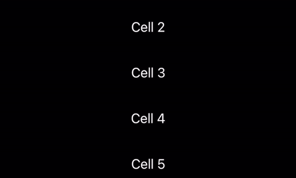
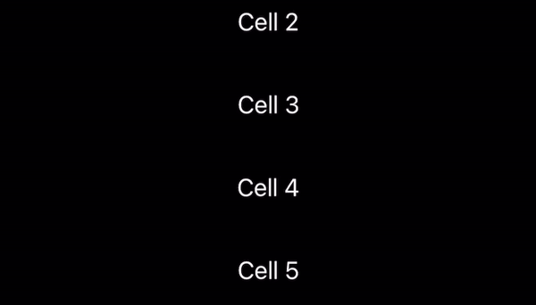

# SwipeActions

<p align="center">
     
     
    
    
    
</p>

Library for creating swipe actions for any SwiftUI View, similar to Apple's [```swipeActions(edge:allowsFullSwipe:content:)```](https://developer.apple.com/documentation/swiftui/view/swipeactions(edge:allowsfullswipe:content:)) that available from iOS 15 and only in List 🤷🏼‍♂️.
You can use SwipeActions in project targeting iOS 13 with any view (for ex. Text in VStack).

## Requirements

- iOS 13.0
- Swift 5.0

## Installation

To use SwipeActions with a project targeting iOS 13, simply copy folder `Source` into your project.

#### Swift Package Manager

To integrate SwipeActions into your project using SwiftPM add the following to your `Package.swift`:

```swift
dependencies: [
    .package(url: "https://github.com/c-villain/SwipeActions", from: "0.1.0"),
],
```
## Quick start

- Adding both leading and trailing swipe actions:

<p align="center">

</p>

```swift
import SwipeActions

struct YourView: View {
    
    var body: some View {
        ScrollView {
            LazyVStack {
                ForEach(1...100, id: \.self) { cell in
                    Text("Cell \(cell)")
                        .frame(height: 50, alignment: .center)
                        .frame(maxWidth: .infinity)
                        .contentShape(Rectangle())
                        .addSwipeAction {
                            Leading {
                                
                                Button {
                                    print("edit \(cell)")
                                } label: {
                                    Image(systemName: "pencil")
                                        .foregroundColor(.white)
                                }
                                .frame(width: 60, height: 50, alignment: .center)
                                .contentShape(Rectangle())
                                .background(Color.green)

                            }
                            Trailing {

                                Button {
                                    print("remove \(cell)")
                                } label: {
                                    Image(systemName: "trash")
                                        .foregroundColor(.white)
                                }
                                .frame(width: 60, height: 50, alignment: .center)
                                .contentShape(Rectangle())
                                .background(Color.red)

                                Button {
                                    print("Inform \(cell)")
                                } label: {
                                    Image(systemName: "bell.slash.fill")
                                        .foregroundColor(.white)
                                }
                                .frame(width: 60, height: 50, alignment: .center)
                                .background(Color.blue)
                            }
                        }
                }
            }
        }
    }
}
```

- Adding one of sides swipe actions:

<p align="center">

</p>

```swift
import SwipeActions

struct YourView: View {
    
    var body: some View {
        ScrollView {
            LazyVStack {
                ForEach(1...100, id: \.self) { cell in
                    Text("Cell \(cell)")
                        .frame(height: 50, alignment: .center)
                        .frame(maxWidth: .infinity)
                        .contentShape(Rectangle())
                        .addSwipeAction (edge: .trailing) {
                            Button {
                                print("remove \(cell)")
                            } label: {
                                Image(systemName: "trash")
                                    .foregroundColor(.white)
                            }
                            .frame(width: 60, height: 50, alignment: .center)
                            .contentShape(Rectangle())
                            .background(Color.red)
                            
                            Button {
                                print("Inform \(cell)")
                            } label: {
                                Image(systemName: "bell.slash.fill")
                                    .foregroundColor(.white)
                            }
                            .frame(width: 60, height: 50, alignment: .center)
                            .background(Color.blue)
                            
                        }
                }
            }
        }
    }
}
```

## Communication

- If you **found a bug**, open an issue or submit a fix via a pull request.
- If you **have a feature request**, open an issue or submit a implementation via a pull request or hit me up on **lexkraev@gmail.com** or **[telegram](https://t.me/lexkraev)**.
- If you **want to contribute**, submit a pull request onto the master branch.

## License

SwipeActions package is released under an MIT license.

## Special thanks

Thx to [Prafulla Singh](https://prafullkumar77.medium.com/) for inspriration with his [SwiftUI tutorial](https://prafullkumar77.medium.com/swiftui-how-to-make-custom-swipe-able-cell-727a27abdddd).
