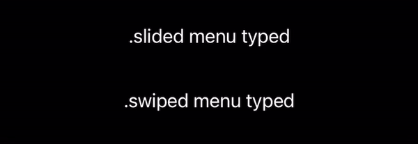
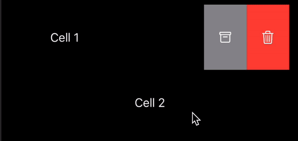
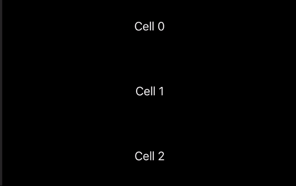
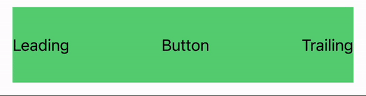
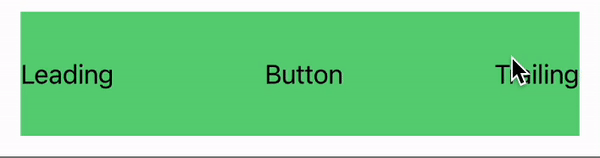

# SwipeActions

<p align="center">
     
    
    
    
    
     
</p>

Library for creating swipe actions for any SwiftUI View, similar to Apple's [```swipeActions(edge:allowsFullSwipe:content:)```](https://developer.apple.com/documentation/swiftui/view/swipeactions(edge:allowsfullswipe:content:)) that available from iOS 15 and only in [List](https://developer.apple.com/documentation/swiftui/lists) 🤷🏼‍♂️.
You can use ```SwipeActions``` in project targeting iOS 13 with any view (e.g. ```Text``` or ```VStack```).

👨🏻‍💻 Feel free to subscribe to channel **[SwiftUI dev](https://t.me/swiftui_dev)** in telegram.

## Requirements

- iOS 13.0
- Swift 5.0

## Installation

To use ```SwipeActions``` with a project targeting iOS 13, simply copy folder `Source` into your project.

#### Swift Package Manager

To integrate ```SwipeActions``` into your project using SwiftPM add the following to your `Package.swift`:

```swift
dependencies: [
    .package(url: "https://github.com/c-villain/SwipeActions", from: "0.1.0"),
],
```
or via [XcodeGen](https://github.com/yonaskolb/XcodeGen) insert into your `project.yml`:

```yaml
name: YourProjectName
options:
  deploymentTarget:
    iOS: 13.0
packages:
  SwipeActions:
    url: https://github.com/c-villain/SwipeActions
    from: 0.1.0
targets:
  YourTarget:
    type: application
    ...
    dependencies:
       - package: SwipeActions
```

## Types

Different types of menu: 
- .swiped
- .slided

<p align="center">

</p>

## Quick start

<details>
  <summary>Adding both leading and trailing swipe actions:</summary>

<p align="center">

</p>

Use ```Leading { ... }``` and ```Trailing { ... }``` closures inside ```.addSwipeAction { ... }``` modifier:

```swift
import SwipeActions

struct YourView: View {
    
    var body: some View {
        ScrollView {
            LazyVStack {
                ForEach(1...100, id: \.self) { cell in
                    Text("Cell \(cell)")
                        .frame(height: 50, alignment: .center)
                        .frame(maxWidth: .infinity)
                        .contentShape(Rectangle())
                        .addSwipeAction {
                            Leading { //<= HERE 
                                
                                Button {
                                    print("edit \(cell)")
                                } label: {
                                    Image(systemName: "pencil")
                                        .foregroundColor(.white)
                                }
                                .frame(width: 60, height: 50, alignment: .center)
                                .contentShape(Rectangle())
                                .background(Color.green)

                            }
                            Trailing { //<= HERE 

                                Button {
                                    print("remove \(cell)")
                                } label: {
                                    Image(systemName: "trash")
                                        .foregroundColor(.white)
                                }
                                .frame(width: 60, height: 50, alignment: .center)
                                .contentShape(Rectangle())
                                .background(Color.red)

                                Button {
                                    print("Inform \(cell)")
                                } label: {
                                    Image(systemName: "bell.slash.fill")
                                        .foregroundColor(.white)
                                }
                                .frame(width: 60, height: 50, alignment: .center)
                                .background(Color.blue)
                            }
                        }
                }
            }
        }
    }
}
```

</details>

<details>
  <summary>Adding swipe actions to one side of view:</summary>

<p align="center">

</p>

Use ```.addSwipeAction(edge: ) { ... }``` modifier, ```edge``` - a ```HorizontalAlignment``` value input parameter - with two cases of using ```.leading``` or ```.trailing```

```swift
import SwipeActions

struct YourView: View {
    
    var body: some View {
        ScrollView {
            LazyVStack {
                ForEach(1...100, id: \.self) { cell in
                    Text("Cell \(cell)")
                        .frame(height: 50, alignment: .center)
                        .frame(maxWidth: .infinity)
                        .contentShape(Rectangle())
                        .addSwipeAction(edge: .trailing) { // <== HERE! choose .trailing or .leading
                            Button {
                                print("remove \(cell)")
                            } label: {
                                Image(systemName: "trash")
                                    .foregroundColor(.white)
                            }
                            .frame(width: 60, height: 50, alignment: .center)
                            .contentShape(Rectangle())
                            .background(Color.red)
                            
                            Button {
                                print("Inform \(cell)")
                            } label: {
                                Image(systemName: "bell.slash.fill")
                                    .foregroundColor(.white)
                            }
                            .frame(width: 60, height: 50, alignment: .center)
                            .background(Color.blue)
                            
                        }
                }
            }
        }
    }
}
```

</details>

<details>
  <summary>For automatically closing other opened actions during sliding: </summary>
  
<p align="center">

</p> 
  
  Add ```SwipeState``` var to your ```View``` and pass it as a ```binding``` in ```.addSwipeAction(state:)```:
  
  ```swift
  
struct YourView: View {  
     @State var state: SwipeState = .untouched // <=== HERE

     var body: some View {
          ScrollView {
               VStack(spacing: 2) {
                   ForEach(1 ... 30, id: \.self) { cell in
                       Text("Cell \(cell)")
                           .addSwipeAction(state: $state) { // <=== HERE
                              ....
                           }
                    }
               }
          }
     }
}
```
  
 </details>
 
### Full swipe action
  
  For full swipe use modifier ```.addFullSwipeAction(menu:swipeColor:swipeRole:state:content:action:)```
  
  Basically there are two main ```SwipeRole``` for full swipe action: ```.destructive``` (defaults) and other one.
  
  <details>
  <summary>.destructive</summary>
  
  This role is used for closing/hiding/removing cell.
  
  
<p align="center">

</p> 
     
  
  ```swift
  
struct YourView: View {  
     
     @State var range: [Int] = [1,2,3,4,5,6,7,8,9,10]

     var body: some View {
          ScrollView {
               VStack(spacing: 2) {
                   ForEach(range, id: \.self) { cell in
                       Text("Cell \(cell)")
                           .addFullSwipeAction(menu: .slided,
                                               swipeColor: .red) { // <=== Color is the same as last button in Trailing for full effect 
                                    Leading { 
                                        ...
                                    }
                                    Trailing {
                                        ...
                                        
                                        Button {
                                            withAnimation { 
                                                if let index = range.firstIndex(of: cell) {
                                                    range.remove(at: index)
                                                }
                                            }
                                        } label: {
                                            Image(systemName: "trash")
                                                .foregroundColor(.white)
                                        }
                                        .contentShape(Rectangle())
                                        .frame(width: 60)
                                        .frame(maxHeight: .infinity)
                                        .background(Color.red) // <=== Look here
                                    }
                                } action: { // <=== action for full swiping
                                    withAnimation {
                                        if let index = range.firstIndex(of: cell) {
                                            range.remove(at: index)
                                        }
                                    }
                                }
                    }
               }
          }
     }
}
```
   </details>
   
   
  <details>
  <summary>.defaults</summary>
  
  This role is used for making some action on cell.
  
<p align="center">

</p> 
     
  
  ```swift
  
struct YourView: View {  ]

     var body: some View {
          ScrollView {
               VStack(spacing: 2) {
                   ForEach(1...10, id: \.self) { cell in
                       Text("Cell \(cell)")
                           .addFullSwipeAction(menu: .slided,
                                               swipeColor: .green, // <=== Color is the same as last button in Trailing for full effect 
                                               swipeRole: .defaults) {  // <=== Add this parameter
                                    Leading { 
                                        ...
                                    }
                                    Trailing {
                                        ...
                                        
                                        Button {
        
                                        } label: {
                                            Image(systemName: "trash")
                                                .foregroundColor(.white)
                                        }
                                        .contentShape(Rectangle())
                                        .frame(width: 60)
                                        .frame(maxHeight: .infinity)
                                        .background(Color.green) // <=== Look here
                                    }
                                } action: { // <=== action for full swiping
                                    ...
                                }
                    }
               }
          }
     }
}
```
   </details>
 
### Recommendations for use

<details>
  <summary>With dynamic height content.</summary>
 
 
use ```.frame(maxHeight: .infinity)```

```swift
YourView()
    .addSwipeAction(menu: .slided, edge: .trailing) {
        Button {
            ...
        } label: {
            Image("trash")
                .font(.system(size: 20.0))
                .foregroundColor(.white)
                .frame(width: 68, alignment: .center)
                .frame(maxHeight: .infinity) // <====== HERE
                .background(.red)
        }
    }
```

</details>

<details>
  <summary>With transparent colored views.</summary>
 
 There is *no* restrictions or any recommendations for using with ```.slided``` type! 
 
 With ```.swiped``` use *non-tranparent* color layer or the same color with ```alfa = 1.0```:

```swift
ForEach(1 ... 30, id: \.self) { cell in
   Text("Cell \(cell)")
       .padding()
       .frame(height: 80)
       .frame(maxWidth: .infinity)
       //.background(Color.green.opacity(0.2)) // <=== DON'T USE SUCH WAY!
       //.background(Color(red: 0.841, green: 0.956, blue: 0.868)) // <== USE THIS WAY!
       .background( // <== OR THIS WAY!
           ZStack {
               Color(UIColor.systemBackground) // non-transparent color layer
               Color.green.opacity(0.2)
           }
       )


       .contentShape(Rectangle())
       .listStyle(.plain)
       .addSwipeAction(menu: .swiped, // <=== SWIPED TYPE
                       state: $state) {
           Leading {
           ...
           }
       }
       ...
 }
```
</details>

<details>
  <summary>With List.</summary>

Basically if you have minimum deployments target for your app is iOS 15 I recommend to use Apple's [swipe actions](https://developer.apple.com/documentation/swiftui/view/swipeactions(edge:allowsfullswipe:content:)) for List. Anyway you may use this.

Due to some features for working with ```List``` you should:

 - specify a frame for cell width, e.g. ```.frame(width: UIScreen.main.bounds.size.width - 32, height: 80)``` and a frame for buttons on swipe actions, e.g. ```.frame(width: 60, height: 80)```. Note that height in frames should be the same!
 
 - add modifier ```.onTapGesture { ... }``` for cell to override tapping on swipe action buttons
 
 - add modifier ```.listRowInsets(EdgeInsets())``` for cell
 
```swift
List(elements) { e in
    Text(e.name)
        .frame(width: UIScreen.main.bounds.size.width - 32, height: 80) // <=== HERE
        .background(Color(UIColor.systemBackground))
        .onTapGesture { // <=== HERE
            print("on cell tap!")
        }
        .addSwipeAction(menu: .swiped,
                        edge: .trailing,
                        state: $state) {
            Button {
                print("remove")
            } label: {
                Image(systemName: "trash")
                    .foregroundColor(.white)
            }
            .frame(width: 60, height: 80, alignment: .center) // <=== HERE
            .contentShape(Rectangle())
            .background(Color.red)
        }
                        .listRowInsets(EdgeInsets()) // <=== HERE
}
.padding(16)
```

Look for code in the example.

</details>

<details>
  <summary>With no horizontal padding views.</summary>

To avoid effect when content in swipe actions started showing immediately after view with no horizontal padding

<p align="center">

</p>

in ```.addSwipeAction { ... }``` add ```Rectangle``` filled with *same* color as root view:

<p align="center">

</p>

```swift
 YourView()
     .frame(height: 80)
     .frame(maxWidth: .infinity)
     .background(Color.green.opacity(0.8)) // <=== Look here!
     .addSwipeAction(edge: .trailing) {
         Rectangle() // <=== HERE!
             .fill(Color.green.opacity(0.8)) // <=== Don't forget!
             .frame(width: 8.0, height: 80)

         Button {
         } label: {
             Image(systemName: "message")
                 .foregroundColor(.white)
         }
         .frame(width: 60, height: 80)
         .contentShape(Rectangle())
         .background(Color.blue)
     }
```

</details>

## Communication

- If you **found a bug**, open an issue or submit a fix via a pull request.
- If you **have a feature request**, open an issue or submit a implementation via a pull request or hit me up on **lexkraev@gmail.com** or **[telegram](https://t.me/lexkraev)**.
- If you **want to contribute**, submit a pull request onto the master branch.

## License

SwipeActions package is released under an MIT license.

## Special thanks

Thx to [Prafulla Singh](https://prafullkumar77.medium.com/) for inspriration with his [SwiftUI tutorial](https://prafullkumar77.medium.com/swiftui-how-to-make-custom-swipe-able-cell-727a27abdddd).
